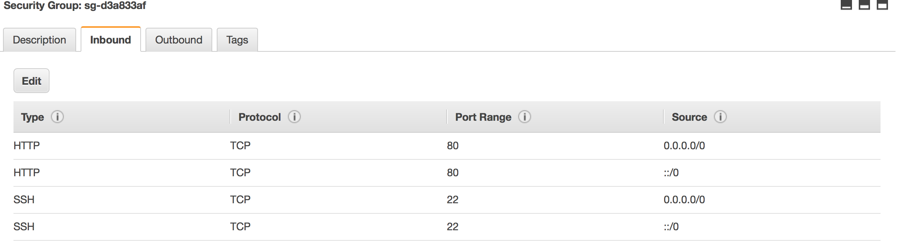

#Deploy Your Rails App To AWS

As developers, we are usually concerned about the development part of any application. We don’t think much about the deployment part as we consider it to be a responsibility of the SysAdmins. But many times, we don’t have a dedicated SysAdmin available, so we have to put on the SysAdmin hat and get things done. There are many options to deploy your Rails application. Today, I will cover how to deploy a Rails application to Amazon Web Services (AWS).

##1. Deploy Your Rails App To AWS With Passenger and Apache on Ubuntu.

###Connect your AWS Instance via Terminal
- First type :

```sudo apt-get update && sudo apt-get -y upgrade```

- Install git :

```sudo apt-get install git```

- Install Ruby via RVM:
```
gpg --keyserver hkp://keys.gnupg.net --recv-keys 409B6B1796C275462A1703113804BB82D39DC0E3
\curl -sSL https://get.rvm.io | bash
source ~/.rvm/scripts/rvm

rvm install 2.4.0
rvm list
rvm --default use ruby-2.4.0
```

- Install Nodejs:

```
sudo apt-get install nodejs
```

- Create your deploy foler:

```
cd /home/ubuntu
sudo mkdir deploy
sudo chown -R ubuntu:ubuntu deploy
cd deploy & clone your project from SVN.
```
- Config your rails app:

```
gem install bundler
bundle install
```

- Test your rails app :

```
rails s -p 3001 -b  0.0.0.0 
```

Your app will run : your_ip:3001

- Install apache :

```
sudo apt-get install apache2
```

- Install Passenger :

First, install the PGP key for the repository server:

`sudo apt-key adv --keyserver keyserver.ubuntu.com --recv-keys 561F9B9CAC40B2F7`

Create an APT source file:

`sudo nano /etc/apt/sources.list.d/passenger.list`

Insert the following line to add the Passenger repository to the file:

`deb https://oss-binaries.phusionpassenger.com/apt/passenger trusty main`

Change the owner and permissions for this file to restrict access to root:

```
sudo chown root: /etc/apt/sources.list.d/passenger.list
sudo chmod 600 /etc/apt/sources.list.d/passenger.list
```
Update the APT cache:

`sudo apt-get update`

Finally, install Passenger:

`sudo apt-get install libapache2-mod-passenger`

Make sure the Passenger Apache module; it maybe enabled already:

`sudo a2enmod passenger`

Restart Apache:

`sudo service apache2 restart`

Now, we need to create a virtual host file for our project. We'll do this by copying the default Apache virtual host:

`sudo cp /etc/apache2/sites-available/000-default.conf /etc/apache2/sites-available/testapp.conf`

Open the config file:

`sudo nano /etc/apache2/sites-available/testapp.conf`

Edit it or replace the existing contents so your final result matches the file shown below. Remember to use your own domain name, and the correct path to your Rails app:

```
<VirtualHost *:80>
    ServerName example.com
    ServerAlias www.example.com
    ServerAdmin webmaster@localhost
    DocumentRoot /home/rails/testapp/public
    RailsEnv development
    ErrorLog ${APACHE_LOG_DIR}/error.log
    CustomLog ${APACHE_LOG_DIR}/access.log combined
    <Directory "/home/rails/testapp/public">
        Options FollowSymLinks
        Require all granted
    </Directory>
</VirtualHost>
```

Basically, this file enables listening to our domain name on port 80, sets an alias for the www subdomain, sets the mail address of our server administrator, sets the root directory for the public directory of our new project, and allows access to our site. You can learn more about Apache virtual hosts by following the link.

To test our setup, we want to see the Rails Welcome aboard page. However, this works only if the application is started in the development environment. Passenger starts the application in the production environment by default, so we need to change this with the RailsEnv option. If your app is ready for production you'll want to leave this setting out.

If you don't want to assign your domain to this app, you can skip the ServerName and ServerAlias lines, or use your IP address.

Disable the default site, enable your new site, and restart Apache:

```
sudo a2dissite 000-default
sudo a2ensite testapp
sudo service apache2 restart
```

Now your app's website should be accessible.

`http://your-instance-ip`

Note : Your Security Group of Instance need config same as :



To update Passenger and Apache, you will need to run a basic system update:

`sudo apt-get update && sudo apt-get upgrade`

After the update process, you will need to restart the web server:

`sudo service apache2 restart`


# Shh with password 

`sudo passwd USERNAME`

Enable password authentication by `editing /etc/ssh/sshd_config`: change `PasswordAuthentication no` to `PasswordAuthentication yes`

`sudo /etc/init.d/ssh restart`

```
$ ssh USERNAME@ec2-________.compute-1.amazonaws.com
USERNAME@ec2-________.compute-1.amazonaws.com's password:
```


